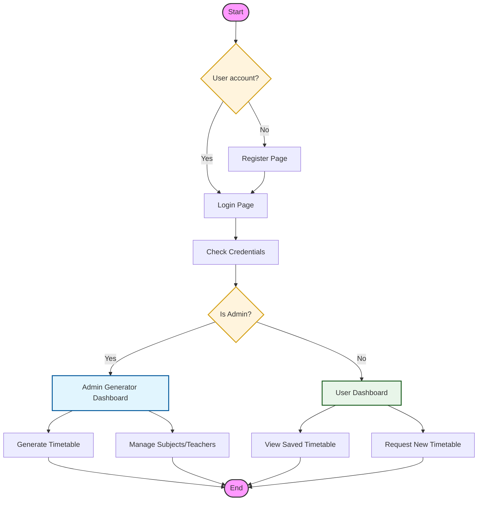
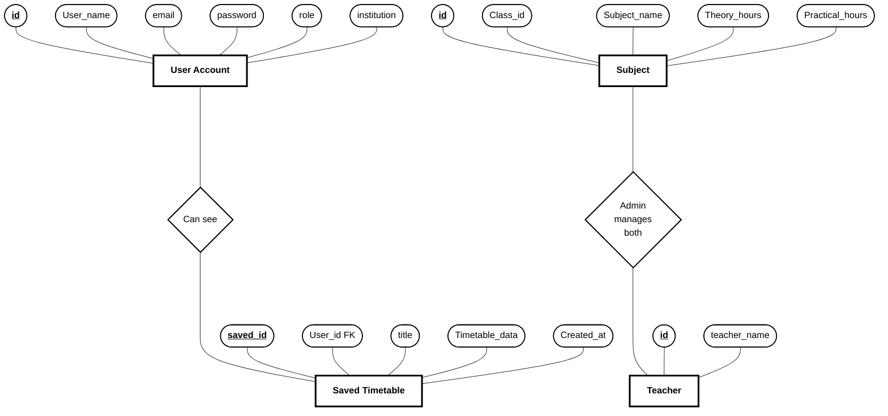

# Project Architecture & Logic: Smart Tutor & Timetable Generator

This document contains the visual representations of the project's logic and data structure.

## 1. Project Workflow Flowchart
The following diagram illustrates the application flow, including user authentication and role-based dashboard redirection.

## 2. Entity Relationship (ER) Diagram
The diagram below uses **Chen Notation** — rectangles for entities, ovals for attributes, and diamonds for relationships.

